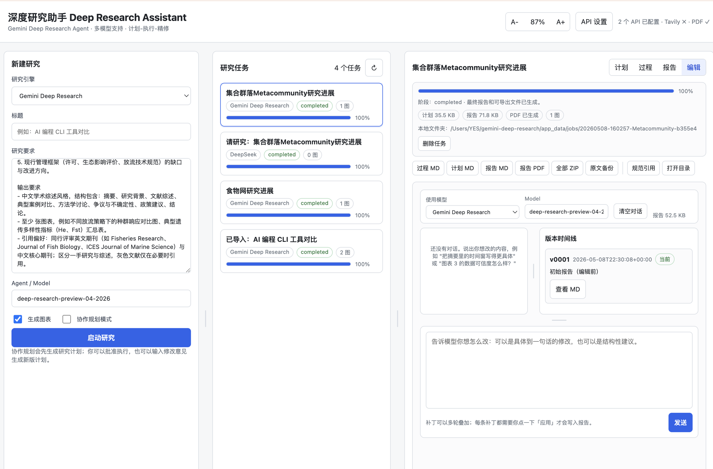
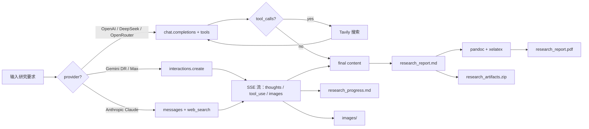
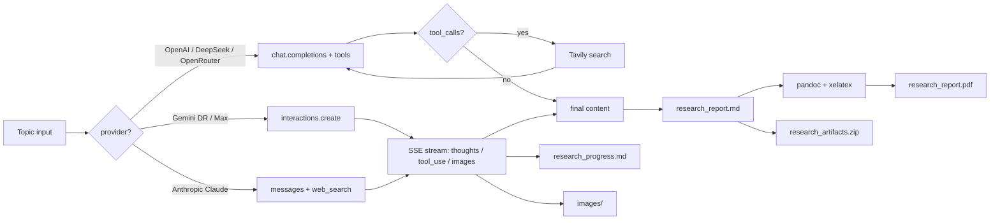

# 深度研究助手 · Deep Research Assistant

[](https://www.python.org/)
[](LICENSE)
[](#架构)
[](#已知限制)

一个本地 Python Web GUI，把 [Gemini Deep Research 智能体][gdr]（自主
规划、多步联网检索、附引文报告）搬到本机运行；同时兼容 Anthropic
Claude（原生 `web_search`）与通过 Tavily 检索的 OpenAI / DeepSeek /
OpenRouter。每个任务的过程、报告、图表与原始 API 返回完整归档到
本机，API key 与任务状态都只保存在你的电脑上。

> [English version](#english) is available below.

---

## 截图

| 主界面（三栏布局） | 报告渲染 |
| --- | --- |
|  |  |

| 编辑：自然语言精修报告 | API 设置弹窗 |
| --- | --- |
|  |  |

左栏新建研究、中栏任务列表与进度、右栏切换"计划 / 过程 / 报告 / 编辑"四视图。
报告内含正文嵌入图表与可点击的数字编号引用；编辑视图用自然语言指挥模型多轮
find/replace 精修，每次应用补丁前都会展示 diff，支持版本回滚。

## 亮点

- **本地优先**：服务器只监听 `127.0.0.1`；设置、任务状态、产物都保存
  在 `app_data/`，默认已加入 `.gitignore`，不依赖任何云端账号体系。
- **每任务完整归档**：每次运行产出 Markdown + PDF + 单个 ZIP，包含
  报告、图表、原始 API 返回与逐步过程日志，便于复核或二次解析。
- **统一的 agentic 任务面板**：Gemini Deep Research / Anthropic Claude /
  DeepSeek / OpenAI / OpenRouter 共用同一个三栏界面；Gemini 还支持
  「协作规划」——先生成研究计划，由你批准或迭代修订后再执行。
- **报告协作编辑器**：完成后切到「编辑」标签，自然语言指挥模型多轮
  find/replace 精修；每条补丁先展示 diff、点「应用」才落盘；版本时间
  线保留每个快照，任意时刻可回滚。可与跑研究时不同的模型搭配使用。
- **`规范引用` 一键整理**：扫描报告里的 `## 参考文献` / `## References`
  章节，回抓每条来源的标题、站点、年份与最终跳转链接，再以 `标题 +
  URL + 访问日期` 重写并重新生成 PDF；原文备份为 `.original.md`。
- **零构建、零外部运行时依赖**：后端只用 Python 标准库 `http.server`，
  前端纯原生 HTML / CSS / JS。

## 快速开始

### 系统要求

- **Python ≥ 3.8**（macOS 自带或 [python.org](https://www.python.org/) 下载）
- **可选**：[`pandoc`](https://pandoc.org) 与 XeLaTeX 引擎（PDF 导出用，
  缺失时仍可生成 Markdown）

### 安装系统依赖

**macOS（Homebrew）**：

```bash
brew install pandoc
brew install --cask mactex-no-gui   # 完整 LaTeX, ~3 GB；或 basictex 体积更小
```

**Linux（Debian / Ubuntu）**：

```bash
sudo apt update
sudo apt install pandoc texlive-xetex texlive-fonts-recommended texlive-lang-cjk
```

**Linux（Fedora）**：

```bash
sudo dnf install pandoc texlive-xetex texlive-collection-langchinese
```

### 启动

```bash
git clone https://github.com/shaowen-ye/deep-research-assistant.git
cd deep-research-assistant
./run_app.sh                    # 或者：python3 app.py
```

浏览器打开 <http://127.0.0.1:8765>，点击 **API 设置** 填入至少一个
provider 的 key。macOS 也可以双击 `Gemini Deep Research.command`。

自定义 host / port：

```bash
python3 app.py --host 127.0.0.1 --port 8765
```

## API Key 申请

| Provider | 申请入口 | 说明 |
| --- | --- | --- |
| **Gemini Deep Research** | [aistudio.google.com](https://aistudio.google.com/apikey) | 在 Google AI Studio 创建 API Key；Deep Research 当前为 preview，需要使用支持的模型。 |
| **Anthropic Claude** | [console.anthropic.com](https://console.anthropic.com/settings/keys) | Claude 账号 → API Keys；Opus 4.7 支持原生 `web_search` 工具，无需 Tavily。 |
| **DeepSeek** | [platform.deepseek.com](https://platform.deepseek.com/api_keys) | 注册后在 API Keys 页面创建。 |
| **OpenAI** | [platform.openai.com](https://platform.openai.com/api-keys) | OpenAI 账号 → API Keys → Create secret key。 |
| **OpenRouter** | [openrouter.ai/keys](https://openrouter.ai/keys) | 一个 key 可调用 367+ 模型，按调用计费。 |
| **Tavily（搜索后端）** | [tavily.com](https://tavily.com) | DeepSeek / OpenAI / OpenRouter 联网研究的搜索引擎；免费 1000 查询 / 月。Anthropic 和 Gemini 不需要。 |

## 配置

可以在 GUI 弹窗中配置 API key、Base URL 与默认模型，保存在
`app_data/settings.json`；也可以使用环境变量。两者并存时 GUI 中的值
优先。

```bash
export GEMINI_API_KEY="..."
export ANTHROPIC_API_KEY="..."
export DEEPSEEK_API_KEY="..."
export OPENAI_API_KEY="..."
export OPENROUTER_API_KEY="..."
export TAVILY_API_KEY="..."          # 可选；OpenAI/DeepSeek/OpenRouter 联网检索后端
```

`app_data/` 已在 `.gitignore` 内，所以 key 与任务产物都不会被推送到
仓库。

### Providers

| Provider | 模式 | 联网检索 | 默认模型 | 说明 |
| --- | --- | --- | --- | --- |
| **Gemini Deep Research** | [Interactions API][gdr] | 原生 | `deep-research-preview-04-2026` | 速度优先，约 80 次搜索查询 / 25 万输入 + 6 万输出 tokens，每任务约 $1–3。 |
| **Gemini Deep Research Max** | [Interactions API][gdr] | 原生 | `deep-research-max-preview-04-2026` | 全面性优先，约 160 次搜索查询 / 90 万输入 + 8 万输出 tokens，每任务约 $3–7，适合深度尽职调查。 |
| **Anthropic Claude** | Messages API + 原生 `web_search` 工具 | 原生 | `claude-opus-4-7` | Claude 自己规划、检索、引用；默认 `max_uses=16`，引用以 `web_search_result_location` 形式返回，会自动汇总到「参考文献」章节。 |
| DeepSeek | OpenAI 兼容 Chat Completions + Tavily 工具调用 | Tavily | `deepseek-v4-pro` | Agentic loop：模型用 `web_search(query)` 调 Tavily，最多 8 轮搜索后出报告。 |
| OpenAI | Chat Completions + Tavily 工具调用 | Tavily | `gpt-5.5` | 同上。 |
| OpenRouter | OpenAI 兼容聚合接口 + Tavily 工具调用 | Tavily | `anthropic/claude-sonnet-4.6` | 同上；一个端点访问 367+ 模型。 |

> 两个 Gemini 模型最长运行 60 分钟（多数任务在 20 分钟内完成）。Anthropic
> 任务通常 1–3 分钟，Tavily-agentic 任务通常 30 秒–2 分钟。价格、配额、
> 模型 ID 都可能变动，详见各 provider 官方文档。

### 模型切换

GUI 的 **API 设置 → Model / Agent** 字段是自由输入框，并提供下拉建议：

- **Gemini**：`deep-research-preview-04-2026` / `deep-research-max-preview-04-2026`
- **Anthropic**：`claude-opus-4-7` / `claude-sonnet-4-6` / `claude-haiku-4-5-20251001`
- **OpenAI**：`gpt-5.5` / `gpt-5.5-pro` / `gpt-5.5-mini` / `gpt-5`
- **DeepSeek**：`deepseek-v4-pro` / `deepseek-chat-v3.1`
- **OpenRouter**：`anthropic/claude-sonnet-4.6` / `anthropic/claude-opus-4.7`
  / `openai/gpt-5.5-pro` / `google/gemini-3.1-flash-lite` /
  `x-ai/grok-4.3` / `deepseek/deepseek-v4-pro`

模型可随时切换，无需重启。新创建的任务会用当前 model；已存档的任务
保留它运行时的 model 信息。

> **未配置 Tavily key 时**：DeepSeek / OpenAI / OpenRouter 自动回退为
> 单次 Chat Completions（无联网），过程日志中会标注。Anthropic / Gemini
> 不受此影响（自带原生搜索）。

## 工作流



## 协作规划模式

当 provider 选 Gemini 且勾选 **协作规划模式** 后，任务流程会多一步
人工审核：

1. **生成计划**：Gemini 先输出一份研究计划（章节大纲、信息源、调研
   重点），保存为 `research_plan.md`。
2. **批准 / 修订**：详情面板提供两个动作：
   - **批准计划**：直接执行该计划，进入正常的 Deep Research 流程。
   - **生成新版**：在文本框里写修改意见（"加强 2020 年后文献"、
     "去掉商业报告，只保留同行评审"等），重新生成计划。
3. **执行**：批准后任务转入 running 状态，继续走 SSE 流式流程，最终
   产出报告。

未勾选协作规划时，任务直接进入执行阶段。该模式仅 Gemini 支持。

## 报告协作编辑

任务完成后，详情面板的 **编辑** 标签页提供一个多轮 AI 协作编辑器：

- 你用自然语言描述要改的地方（"摘要里的时间窗写得更具体"、"图表 3
  的数据可信度怎么样"），模型在阅读完整报告后，要么继续讨论，要么
  返回若干**结构化补丁**（一次只动一处，每条补丁是一对 find / replace）。
- 每条补丁都是一张可审阅的卡片，对照高亮原文与替换文本；点击 **应用**
  才会真正写入 `research_report.md`，**拒绝** 则保留在对话记录里供以后
  追溯。补丁里的 `find` 必须在当前报告中唯一出现，否则会被标记为
  无法应用，避免误改。
- 每次 **应用** 都会把当前报告快照存到 `report_versions/v0001.md`、
  `v0002.md`…，并写入 `manifest.json`；任意时刻可以从右侧"版本时间线"
  回滚到任意旧版（回滚动作本身也会作为新版本入库，不会覆盖历史）。
- 编辑器使用的对话模型独立选择，可与生成报告时所用 provider / model
  不同——例如让 DeepSeek 起稿、用 Claude 精修。

适合的工作模式是：先跑一次研究生成基线报告，再用编辑器多轮打磨直到
满意。

## 输出

每次任务保存到 `app_data/jobs/<slug>-<id>/`：

| 文件 | 说明 |
| --- | --- |
| `state.json` | 序列化的任务状态：title、provider、模式、进度、citations、时间戳。 |
| `research_progress.md` | SSE 流式记录：模型思考、工具调用、检索源、生成的图表、引用编号。 |
| `research_plan.md` | 仅协作规划模式：Gemini 生成的研究计划全文。 |
| `research_report.md` | 最终 Markdown 报告，含正文嵌入图表与编号引用。 |
| `research_report.pdf` | pandoc + xelatex 可用时生成的可分享 PDF。 |
| `images/` | 报告引用的 PNG / JPEG 图表，按 `figure-N.png` 命名。 |
| `interaction_final.json` | API 原始最终响应，便于二次解析或调试。 |
| `editor_session.json` | 编辑器多轮对话历史与每条补丁的状态（pending / applied / rejected）。 |
| `report_versions/v*.md` + `manifest.json` | 每次"应用补丁"或"回滚"都会写入一个版本快照及元数据，可任意回滚。 |

详情面板提供：

- **Markdown / PDF / ZIP** 下载（ZIP 把上述全部打包）
- **规范引用**：扫描报告中的 `## 参考文献` / `## Sources` / `## References`
  章节，对每个引用 URL 抓取 `<title>`、`og:site_name`、发表年份与最终
  跳转 URL（5 秒超时，跳过失败项），用 `标题 + URL + 访问日期` 重写
  整个章节；原文备份为 `research_report.original.md`，并重新生成 PDF。
  对 Gemini 输出的 `[cite:N]` 标记也会顺便替换为 `[N](url)` 形式。
- **在 Finder 中显示**：直接打开任务目录。

## 架构

后端是标准库 `ThreadingHTTPServer`，没有 Web 框架，没有构建步骤。
逻辑分散在 `core/`：

| 模块 | 职责 |
| --- | --- |
| `app.py` | CLI 入口，串联 `core.config` 与 `core.server`。 |
| `core/server.py` | HTTP 路由：任务、设置、静态文件、SSE。 |
| `core/config.py` | 数据目录、provider 默认值、Tavily key、settings 读写、密钥掩码。 |
| `core/state.py` | 任务状态磁盘持久化与内存锁。 |
| `core/worker.py` | 任务生命周期、线程、模式分发、计划批准流程。 |
| `core/gemini.py` | Deep Research Interactions API 与 SSE 事件循环。 |
| `core/anthropic.py` | Anthropic messages API + 原生 `web_search` 工具的流式适配。 |
| `core/openai_research.py` | OpenAI 兼容 provider 的 agentic loop（tool_use + Tavily）。 |
| `core/chat.py` | 单次 Chat Completions（Tavily key 缺失时的 fallback）。 |
| `core/editor.py` | 报告协作编辑器：多轮对话、find/replace 补丁、版本快照与回滚。 |
| `core/tavily.py` | Tavily 搜索 API 的 stdlib 客户端。 |
| `core/citations.py` | 来源元数据抓取与数字编号引用。 |
| `core/exporters.py` | Markdown → PDF（pandoc）与 ZIP 打包。 |
| `core/http_client.py` | 基于 stdlib `urllib` 的最小 JSON 客户端。 |
| `core/common.py` | `utc_now`、`slugify` 与 JSON 文件辅助函数。 |

模块间 import 形成 DAG：
`common → config → state, http_client, tavily → citations, exporters → gemini, anthropic, openai_research, chat, editor → worker → server`。

前端是 `static/index.html` + `static/app.js` + `static/styles.css`，
原生 JS，无打包工具。

## 故障排查

| 现象 | 可能原因与处理 |
| --- | --- |
| **PDF 导出失败，但 Markdown 正常** | `pandoc` 或 `xelatex` 未安装，或字体不全（中文报告需要 `texlive-lang-cjk`）。检查 `which pandoc xelatex`；首页右上角显示"PDF 不可用"也是这个原因。 |
| **任务卡在 "running"，长时间无进展** | SSE 长连接被网络/代理切断。Gemini 任务最长 60 分钟，多数 20 分钟内完成；如卡住超过 30 分钟，可点 **停止** 后重建任务。 |
| **HTTP 429 / Rate limit / Quota exceeded** | 触达 provider 速率上限。Gemini Deep Research 在预览阶段的并发与日额度较紧；隔几分钟再试或换 provider。 |
| **报告里引用编号错乱、空白链接** | 个别来源页面拒绝 metadata 抓取或返回非 HTML。点详情区 **规范引用** 重新扫描重排即可。 |
| **API key 已配置但 health 显示"未配置"** | 1) 环境变量未通过当前 shell 传给 `python3 app.py`；2) GUI 中保存后未刷新页面。重启服务或刷新 GUI。 |
| **macOS 双击 `.command` 启动失败** | 终端权限问题；`chmod +x "Gemini Deep Research.command"` 后再双击；或直接终端 `./run_app.sh`。 |
| **端口被占用** | `python3 app.py --port 8766`；或 `lsof -ti tcp:8765 \| xargs kill`。 |

## 开发

### 本地启动与热改

```bash
git clone https://github.com/shaowen-ye/deep-research-assistant.git
cd deep-research-assistant
python3 app.py --port 8766          # 不要踩生产用的 8765
```

后端是 stdlib `ThreadingHTTPServer`，**修改 `core/*.py` 后需重启进程**；
前端 `static/*` 改动刷新浏览器即可。

### 调试

- 任务状态可直接读 `app_data/jobs/<slug-id>/state.json`。
- Gemini SSE 原始事件流会保存到 `interaction_stream_raw.sse`（如果保留
  调试输出）。
- HTTP 接口可用 curl 单测：`curl http://127.0.0.1:8765/api/health`。

### 代码风格

没有强制 linter，遵循以下原则：

- 后端保持 stdlib-only；不要引入 Flask / FastAPI / requests / pydantic。
- 前端保持 build-less；不要引入 React / Vue / npm 依赖。
- 不要破坏 `core/` 的 import DAG（避免循环）。
- 不要把 `app_data/` 内任何文件提交到仓库。

## 贡献

欢迎 Issue 与 Pull Request。

- Bug 报告建议附上：Python 版本、provider、`state.json` 摘要，以及
  `research_progress.md` 中的相关片段。
- 新功能 PR：请先开 Issue 讨论方向。
- UI / UX 改动请在 PR 中附上 before / after 截图。

## 已知限制

- **OpenAI / DeepSeek / OpenRouter 必须配 Tavily key 才能联网**：未配置
  时自动回退为单次 Chat Completions（无搜索）；过程日志会标注。Anthropic
  与 Gemini 自带原生搜索，不受影响。
- **单进程、无并发上限**：所有任务跑在同一个 Python 进程的线程池里；
  超过 ~10 个并发任务可能挤占 SSE 带宽。
- **无鉴权层**：默认监听 `127.0.0.1`，没有登录校验；如需对外暴露，请
  自行加鉴权（反向代理 + Basic Auth / OAuth）。
- **PDF 中文排版**：依赖 `texlive-lang-cjk`；缺字体时会回退到默认
  XeLaTeX 字体，可能显示豆腐方块。
- **Gemini Deep Research / Anthropic web_search 仍是 preview**：API 模型
  名、价格、配额都可能变动；请以各家官方文档为准。

## Roadmap

近期计划（不构成承诺）：

- [x] ~~给非 Gemini provider 加联网检索能力~~（已实现：Anthropic 用原生
      web_search，OpenAI / DeepSeek / OpenRouter 用 Tavily agentic loop）。
- [ ] 把 OpenAI 的 Responses API 原生 web_search 也作为可选后端，免去
      Tavily key。
- [ ] 任务标签与全文搜索。
- [ ] 多窗口同时跑任务的 UI 适配。
- [ ] 单元测试与 CI（GitHub Actions）。

欢迎在 Issues 提需求或投票。

## 许可

MIT，见 [LICENSE](LICENSE)。

[gdr]: https://ai.google.dev/gemini-api/docs/interactions/deep-research

---

<a id="english"></a>

## English

A local Python web GUI that runs the [Gemini Deep Research agent][gdr]
(autonomous planning, multi-step web research, cited reports) on your
own machine, with extra support for Anthropic Claude (native
`web_search`) and OpenAI-compatible providers — DeepSeek, OpenAI,
OpenRouter — via a Tavily-backed agentic loop. Every job's progress,
report, figures, and raw API responses are archived locally; API keys,
job state, and outputs never leave your computer.

### Screenshots

| Main view | Report rendering |
| --- | --- |
|  |  |

| Editor: refine reports in natural language | Settings modal |
| --- | --- |
|  |  |

Three-pane layout: composer (left), job list with live progress (middle),
and a tabbed detail panel for **Plan / Progress / Report / Editor**
(right). Reports include inline figures and clickable numbered citations;
the editor lets you steer the model through find/replace patches with
diff previews and version rollback.

### Highlights

- **Local-first** — server binds to `127.0.0.1`; settings, job state, and
  generated artifacts live under `app_data/` and are gitignored by default;
  no cloud account, no telemetry.
- **Full per-job archive** — every run produces Markdown + PDF + a single
  ZIP with the report, figures, raw API responses, and step-by-step
  progress logs, so each job is fully auditable and re-parsable.
- **One agentic panel for every supported provider** — Gemini Deep
  Research, Anthropic Claude, DeepSeek, OpenAI, and OpenRouter all share
  the same three-pane UI; Gemini additionally exposes a
  **plan → approve → execute** loop (协作规划) for human-in-the-loop runs.
- **Collaborative report editor** — once a job finishes, switch to the
  Editor tab and steer the model in natural language. Each suggested
  patch is a reviewable find/replace diff card; only after you click
  Apply does it land in `research_report.md`. Every apply snapshots a
  new version that you can roll back to. The editor model is chosen
  independently from the research model.
- **One-click `规范引用`** — scans the report's `## 参考文献` /
  `## References` section, refetches each source's title, site, year, and
  final URL, and rewrites the section as `title + URL + access date`,
  then regenerates the PDF. The original is preserved as `.original.md`.
- **No build step, no external runtime deps** — Python stdlib backend
  (`http.server`), vanilla HTML/CSS/JS frontend.

### Quickstart

#### Requirements

- **Python ≥ 3.8**
- **Optional**: [`pandoc`](https://pandoc.org) and an XeLaTeX engine for
  PDF export

#### Install system dependencies

**macOS (Homebrew)**:

```bash
brew install pandoc
brew install --cask mactex-no-gui     # full LaTeX, ~3 GB; or basictex for smaller
```

**Linux (Debian / Ubuntu)**:

```bash
sudo apt update
sudo apt install pandoc texlive-xetex texlive-fonts-recommended texlive-lang-cjk
```

**Linux (Fedora)**:

```bash
sudo dnf install pandoc texlive-xetex texlive-collection-langchinese
```

#### Run

```bash
git clone https://github.com/shaowen-ye/deep-research-assistant.git
cd deep-research-assistant
./run_app.sh                          # or: python3 app.py
```

Open <http://127.0.0.1:8765>, click **API 设置**, and add at least one
provider key. On macOS you can also double-click
`Gemini Deep Research.command`.

Custom host / port:

```bash
python3 app.py --host 127.0.0.1 --port 8765
```

### Getting API Keys

| Provider | Console | Notes |
| --- | --- | --- |
| **Gemini Deep Research** | [aistudio.google.com](https://aistudio.google.com/apikey) | Create an API key in Google AI Studio. Deep Research is in preview; ensure your key has access. |
| **Anthropic Claude** | [console.anthropic.com](https://console.anthropic.com/settings/keys) | Anthropic console → API Keys; Opus 4.7 supports native `web_search`, Tavily not required. |
| **DeepSeek** | [platform.deepseek.com](https://platform.deepseek.com/api_keys) | Sign up, then create a key on the API Keys page. |
| **OpenAI** | [platform.openai.com](https://platform.openai.com/api-keys) | OpenAI account → API Keys → Create secret key. |
| **OpenRouter** | [openrouter.ai/keys](https://openrouter.ai/keys) | One key reaches 367+ models, pay-per-call. |
| **Tavily (search backend)** | [tavily.com](https://tavily.com) | Search engine for the DeepSeek / OpenAI / OpenRouter agentic loop; free tier 1,000 queries/month. Anthropic and Gemini do not need it. |

### Configuration

Provider keys can be configured either in the GUI (stored in
`app_data/settings.json`) or via environment variables. The GUI value wins
when both are set.

```bash
export GEMINI_API_KEY="..."
export ANTHROPIC_API_KEY="..."
export DEEPSEEK_API_KEY="..."
export OPENAI_API_KEY="..."
export OPENROUTER_API_KEY="..."
export TAVILY_API_KEY="..."          # optional; search backend for OpenAI/DeepSeek/OpenRouter
```

`app_data/` is in `.gitignore`, so neither keys nor job outputs are pushed.

#### Providers

| Provider | Mode | Web search | Default model | Notes |
| --- | --- | --- | --- | --- |
| **Gemini Deep Research** | [Interactions API][gdr] | native | `deep-research-preview-04-2026` | Speed-oriented; ~80 search queries / ~250k input + ~60k output tokens; ~$1–3 per task. |
| **Gemini Deep Research Max** | [Interactions API][gdr] | native | `deep-research-max-preview-04-2026` | Comprehensiveness-oriented; ~160 search queries / ~900k input + ~80k output tokens; ~$3–7 per task; suited to deep due diligence. |
| **Anthropic Claude** | Messages API + native `web_search` tool | native | `claude-opus-4-7` | Claude plans queries, searches, and cites itself; default `max_uses=16`; citations are returned as `web_search_result_location` and rolled up into the «参考文献» section. |
| DeepSeek | OpenAI-compatible Chat Completions + Tavily tool calls | Tavily | `deepseek-v4-pro` | Agentic loop: model invokes `web_search(query)` against Tavily, up to 8 rounds, then writes the report. |
| OpenAI | Chat Completions + Tavily tool calls | Tavily | `gpt-5.5` | Same as above. |
| OpenRouter | OpenAI-compatible aggregator + Tavily tool calls | Tavily | `anthropic/claude-sonnet-4.6` | Same as above; one endpoint reaches 367+ models. |

> Gemini jobs cap at 60 minutes (most finish within 20). Anthropic jobs
> typically take 1–3 minutes; Tavily-agentic jobs typically take
> 30 sec–2 min. Pricing, quotas and model IDs may change — see each
> provider's docs.

#### Switching models

The **API 设置 → Model / Agent** field is a free-form input with autocomplete
suggestions:

- **Gemini**: `deep-research-preview-04-2026` / `deep-research-max-preview-04-2026`
- **Anthropic**: `claude-opus-4-7` / `claude-sonnet-4-6` / `claude-haiku-4-5-20251001`
- **OpenAI**: `gpt-5.5` / `gpt-5.5-pro` / `gpt-5.5-mini` / `gpt-5`
- **DeepSeek**: `deepseek-v4-pro` / `deepseek-chat-v3.1`
- **OpenRouter**: `anthropic/claude-sonnet-4.6` / `anthropic/claude-opus-4.7`
  / `openai/gpt-5.5-pro` / `google/gemini-3.1-flash-lite` /
  `x-ai/grok-4.3` / `deepseek/deepseek-v4-pro`

Models can be changed any time without restarting. New jobs use the current
model; archived jobs preserve the model they ran with.

> **Without a Tavily key**, DeepSeek / OpenAI / OpenRouter automatically
> fall back to a single Chat Completions call (no web search), and the
> progress log says so. Anthropic and Gemini are unaffected (they have
> their own native search).

### Workflow



### Collaborative Planning

When you pick the Gemini provider and tick **协作规划模式**, the run gets a
human-in-the-loop step:

1. **Plan generation** — Gemini emits a research plan (section outline,
   sources, focus areas) saved as `research_plan.md`.
2. **Approve / refine** — the detail pane shows two actions:
   - **批准计划** (approve) — execute the plan as-is and continue the normal
     Deep Research flow.
   - **生成新版** (refine) — type guidance ("focus on post-2020 papers",
     "drop industry reports, peer-reviewed only", etc.) and Gemini will
     produce a revised plan.
3. **Execute** — once approved, the job transitions to running, the SSE
   stream resumes, and the final report is produced.

Without the checkbox, the job goes straight to execution. Only Gemini
supports this mode.

### Collaborative report editing

Once a report is generated, the **编辑** (Edit) tab opens a multi-turn
AI editing loop:

- Tell the model what to change in plain language ("tighten the abstract
  with a specific year window", "is the data in figure 3 trustworthy?").
  After reading the full report it either keeps discussing or returns
  one or more **structured patches** — each one a small, focused
  find/replace pair, with the original text and the proposed replacement
  shown side by side.
- Patches are reviewed one card at a time: hit **应用** (Apply) to write
  it into `research_report.md`, or **拒绝** (Reject) to keep it in the
  conversation log without applying. A patch's `find` text must appear
  exactly once in the current report — if it doesn't (e.g. the model
  paraphrased), the card is flagged unapplicable instead of silently
  doing the wrong thing.
- Each Apply snapshots the report to `report_versions/v0001.md`,
  `v0002.md`, … with `manifest.json` recording timestamps and applied
  patches. The right-side **版本时间线** (version timeline) lets you
  roll back to any prior version; rollbacks are themselves recorded as
  new versions, so history is never overwritten.
- The chat model used by the editor is picked independently of the
  research provider — for example, draft with DeepSeek and polish with
  Claude.

The intended workflow is to run a research job once for a baseline
report, then iterate with the editor until the report is publishable.

### Output

Each job is saved to `app_data/jobs/<slug>-<id>/`:

| File | Purpose |
| --- | --- |
| `state.json` | Serialized job state: title, provider, mode, progress, citations, timestamps. |
| `research_progress.md` | SSE log: model thoughts, tool calls, retrieval sources, generated figures, citation numbers. |
| `research_plan.md` | Collaborative planning only — Gemini's full research plan. |
| `research_report.md` | Final markdown report with inline figures and numbered citations. |
| `research_report.pdf` | Shareable PDF if pandoc + xelatex are available. |
| `images/` | PNG / JPEG figures referenced from the report (`figure-N.png`). |
| `interaction_final.json` | Raw final API response for re-parsing or debugging. |
| `editor_session.json` | Editor chat history with each patch's status (pending / applied / rejected). |
| `report_versions/v*.md` + `manifest.json` | Every Apply or rollback writes a new version snapshot with metadata; any version can be restored. |

Detail-pane actions:

- **Markdown / PDF / ZIP** downloads (ZIP packs everything above)
- **规范引用** — scans the report for a `## 参考文献` / `## Sources` /
  `## References` section, fetches each cited URL's `<title>`,
  `og:site_name`, publication year and final redirect URL (5 sec timeout,
  failures skipped), and rewrites the section as `title + URL + access
  date`. The original is backed up to `research_report.original.md`, and
  the PDF is regenerated. For Gemini's `[cite:N]` legacy markers, those
  are also replaced with `[N](url)` form along the way.
- **在 Finder 中显示** — open the job folder.

### Architecture

The backend is a stdlib `ThreadingHTTPServer`. No web framework, no build
step. Logic is split across `core/`:

| Module | Role |
| --- | --- |
| `app.py` | CLI entrypoint. Wires `core.config` and `core.server`. |
| `core/server.py` | HTTP routing for jobs, settings, static files, SSE. |
| `core/config.py` | Data dirs, provider defaults, Tavily key, settings load/save, secret masking. |
| `core/state.py` | Per-job state on disk + in-memory locks. |
| `core/worker.py` | Job lifecycle, threading, mode dispatch, plan approval flow. |
| `core/gemini.py` | Deep Research Interactions API + SSE event loop. |
| `core/anthropic.py` | Anthropic messages API + native `web_search` streaming adapter. |
| `core/openai_research.py` | Agentic loop for OpenAI-compatible providers (tool_use + Tavily). |
| `core/chat.py` | Single-shot OpenAI-compatible Chat Completions (fallback when Tavily key is missing). |
| `core/editor.py` | Collaborative report editor: multi-turn chat, find/replace patches, version snapshots and rollback. |
| `core/tavily.py` | stdlib client for the Tavily search API. |
| `core/citations.py` | Source metadata fetch, numbered references. |
| `core/exporters.py` | Markdown → PDF via pandoc, ZIP packaging. |
| `core/http_client.py` | Minimal stdlib `urllib` JSON wrapper. |
| `core/common.py` | `utc_now`, `slugify`, JSON file helpers. |

Imports form a DAG:
`common → config → state, http_client, tavily → citations, exporters → gemini, anthropic, openai_research, chat, editor → worker → server`.

The frontend is `static/index.html` + `static/app.js` + `static/styles.css`.
Vanilla JS, no bundler.

### Troubleshooting

| Symptom | Cause / Fix |
| --- | --- |
| **PDF export fails, Markdown is fine** | `pandoc` or `xelatex` missing, or fonts incomplete (Chinese reports need `texlive-lang-cjk`). Check `which pandoc xelatex`; the header showing "PDF 不可用" indicates the same. |
| **Job stuck on "running" with no progress** | SSE long-poll dropped by network/proxy. Gemini jobs cap at 60 minutes (most finish in 20). If stuck > 30 min, click **停止** and recreate. |
| **HTTP 429 / Rate limit / Quota exceeded** | Provider rate limit. Gemini Deep Research preview has tight concurrency/daily quotas; retry later or switch provider. |
| **Citation numbers garbled, blank links** | Some source pages refuse metadata scraping or return non-HTML. Click **规范引用** to rescan and renumber. |
| **API key configured but health says "未配置"** | (a) env var didn't reach the Python process; (b) GUI didn't refresh after save. Restart the server or reload the page. |
| **macOS `.command` launch fails** | `chmod +x "Gemini Deep Research.command"` and double-click again; or use terminal `./run_app.sh`. |
| **Port in use** | `python3 app.py --port 8766`; or `lsof -ti tcp:8765 \| xargs kill`. |

### Development

#### Local run with hot-edit

```bash
git clone https://github.com/shaowen-ye/deep-research-assistant.git
cd deep-research-assistant
python3 app.py --port 8766            # avoid the production 8765
```

The backend is a stdlib `ThreadingHTTPServer` — **changes to `core/*.py`
require restarting the process**. Frontend `static/*` changes are picked up
on browser refresh.

#### Debugging

- Read `app_data/jobs/<slug-id>/state.json` directly to inspect job state.
- Raw Gemini SSE events can be saved to `interaction_stream_raw.sse` (if
  you keep debug output enabled).
- HTTP endpoints are testable with curl: `curl http://127.0.0.1:8765/api/health`.

#### Code style

No enforced linter. Follow these rules:

- Backend stays stdlib-only — no Flask / FastAPI / requests / pydantic.
- Frontend stays build-less — no React / Vue / npm.
- Don't break the `core/` import DAG (no cycles).
- Never commit anything from `app_data/`.

### Contributing

Issues and pull requests are welcome.

- Bug reports should ideally include: Python version, provider, an
  abbreviated `state.json`, and the relevant lines from
  `research_progress.md`.
- For new features, please open an issue first to align on direction.
- For UI/UX changes, attach a short before/after screenshot in the PR.

### Known limits

- **OpenAI / DeepSeek / OpenRouter need a Tavily key to actually browse**
  — without one they fall back to a single Chat Completions call (no web
  search) and the progress log says so. Anthropic and Gemini have native
  search, unaffected.
- **Single process, no concurrency cap** — all jobs run in one Python
  process's thread pool; > ~10 concurrent jobs may saturate SSE bandwidth.
- **No auth layer** — listens on `127.0.0.1` only. Add your own auth
  (reverse proxy + Basic Auth / OAuth) before exposing externally.
- **CJK PDF rendering** — needs `texlive-lang-cjk`; missing fonts fall back
  to default XeLaTeX, which can render tofu blocks.
- **Gemini Deep Research / Anthropic web_search are still preview** — model
  IDs, pricing and quotas may change; rely on each provider's official
  docs.

### Roadmap

Tentative (not commitments):

- [x] ~~Web-search pipeline for non-Gemini providers~~ (done: Anthropic
      uses native `web_search`; OpenAI / DeepSeek / OpenRouter use a
      Tavily-backed agentic loop).
- [ ] Plug OpenAI's Responses API native `web_search` in as an alternate
      backend so a Tavily key isn't required.
- [ ] Job tags and full-text search.
- [ ] Multi-window UI for running parallel jobs.
- [ ] Unit tests + CI (GitHub Actions).

Open an issue to request or upvote features.

### License

MIT — see [LICENSE](LICENSE).
