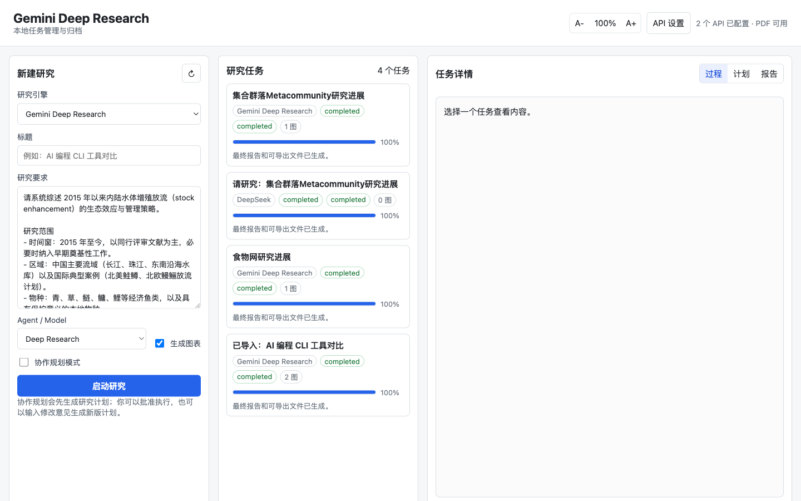
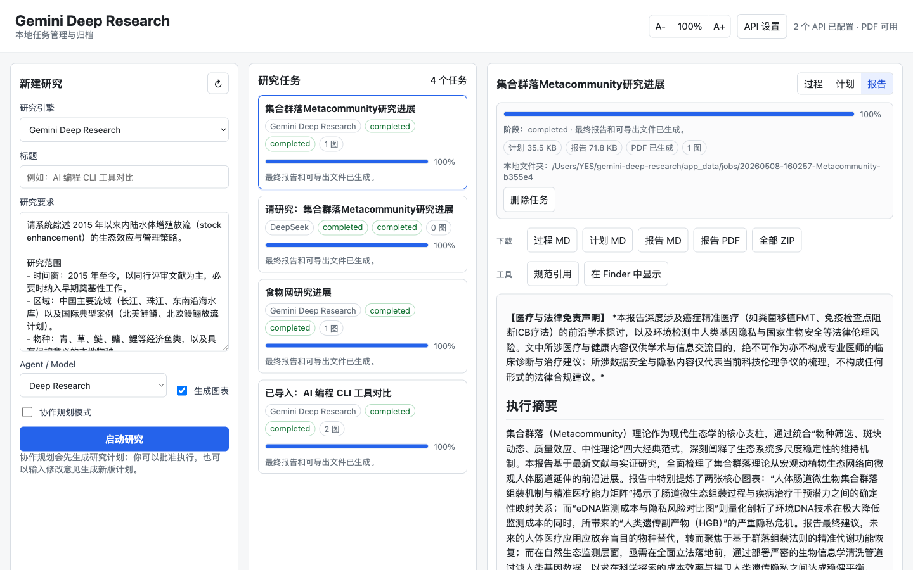
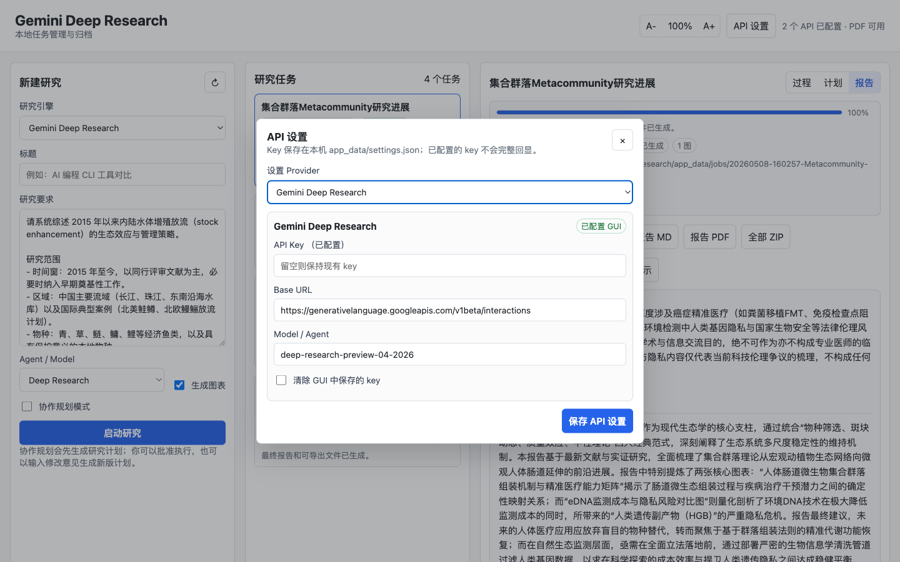
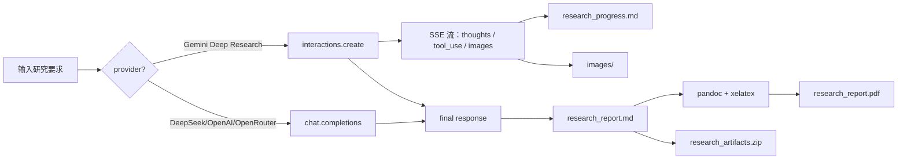
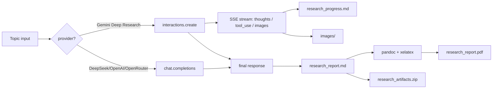

# Gemini Deep Research Local App

[](https://www.python.org/)
[](LICENSE)
[](#架构)
[](#已知限制)

一个本地 Python Web GUI，用来调用 [Gemini Deep Research][gdr] 与 OpenAI
兼容的 Chat Completions（DeepSeek / OpenAI / OpenRouter）完成长任务式
研究，并把过程、报告、图表、原始 API 返回完整归档到本机。所有 API
key、任务状态与产物都只保存在你的电脑上。

> [English version](#english) is available below.

---

## 截图

| 主界面（三栏布局） | 报告渲染 | API 设置弹窗 |
| --- | --- | --- |
|  |  |  |

左栏新建研究、中栏任务列表与进度、右栏切换"过程 / 计划 / 报告"三视图，
报告内含正文嵌入图表与可点击的数字编号引用。

## 亮点

- **Gemini Deep Research 端到端**：长任务、SSE 流式、协作规划、引用、
  正文嵌入图表、计划批准与修订循环；可切换 **Deep Research Max** 获取
  更高搜索量与上下文，适合深度尽职调查或竞争分析。
- **三个 OpenAI 兼容 fallback**：DeepSeek / OpenAI / OpenRouter 走 Chat
  Completions，适合低成本草稿和后期整理。
- **本地优先**：服务器只监听 `127.0.0.1`；设置、任务状态、产物都保存
  在 `app_data/`，默认已加入 `.gitignore`。
- **每任务可归档**：每次运行产出 Markdown + PDF + 单个 ZIP，包含报告、
  图表、原始 API 返回与过程日志。
- **零构建、零外部运行时依赖**：后端用 Python 标准库 `http.server`，
  前端用原生 HTML / CSS / JS。

## 快速开始

### 系统要求

- **Python ≥ 3.8**（macOS 自带或 [python.org](https://www.python.org/) 下载）
- **可选**：[`pandoc`](https://pandoc.org) 与 XeLaTeX 引擎（PDF 导出用，
  缺失时仍可生成 Markdown）

### 安装系统依赖

**macOS（Homebrew）**：

```bash
brew install pandoc
brew install --cask mactex-no-gui   # 完整 LaTeX, ~3 GB；或 basictex 体积更小
```

**Linux（Debian / Ubuntu）**：

```bash
sudo apt update
sudo apt install pandoc texlive-xetex texlive-fonts-recommended texlive-lang-cjk
```

**Linux（Fedora）**：

```bash
sudo dnf install pandoc texlive-xetex texlive-collection-langchinese
```

### 启动

```bash
git clone https://github.com/shaowen-ye/gemini-deep-research-local-app.git
cd gemini-deep-research-local-app
./run_app.sh                    # 或者：python3 app.py
```

浏览器打开 <http://127.0.0.1:8765>，点击 **API 设置** 填入至少一个
provider 的 key。macOS 也可以双击 `Gemini Deep Research.command`。

自定义 host / port：

```bash
python3 app.py --host 127.0.0.1 --port 8765
```

## API Key 申请

| Provider | 申请入口 | 说明 |
| --- | --- | --- |
| **Gemini Deep Research** | [aistudio.google.com](https://aistudio.google.com/apikey) | 在 Google AI Studio 创建 API Key；Deep Research 当前为 preview，需要使用支持的模型。 |
| **DeepSeek** | [platform.deepseek.com](https://platform.deepseek.com/api_keys) | 注册后在 API Keys 页面创建。 |
| **OpenAI** | [platform.openai.com](https://platform.openai.com/api-keys) | OpenAI 账号 → API Keys → Create secret key。 |
| **OpenRouter** | [openrouter.ai/keys](https://openrouter.ai/keys) | 一个 key 可调用 367+ 模型，按调用计费。 |

## 配置

可以在 GUI 弹窗中配置 API key、Base URL 与默认模型，保存在
`app_data/settings.json`；也可以使用环境变量。两者并存时 GUI 中的值
优先。

```bash
export GEMINI_API_KEY="..."
export DEEPSEEK_API_KEY="..."
export OPENAI_API_KEY="..."
export OPENROUTER_API_KEY="..."
```

`app_data/` 已在 `.gitignore` 内，所以 key 与任务产物都不会被推送到
仓库。

### Providers

| Provider | 模式 | 模型 | 说明 |
| --- | --- | --- | --- |
| **Gemini Deep Research** | [Interactions API][gdr] | `deep-research-preview-04-2026`（默认） | 速度优先，约 80 次搜索查询 / 25 万输入 + 6 万输出 tokens，每任务约 $1–3。 |
| **Gemini Deep Research Max** | [Interactions API][gdr] | `deep-research-max-preview-04-2026` | 全面性优先，约 160 次搜索查询 / 90 万输入 + 8 万输出 tokens，每任务约 $3–7，适合深度尽职调查。 |
| DeepSeek | OpenAI 兼容 Chat Completions | `deepseek-v4-pro`（默认） | 低成本一次性报告生成。 |
| OpenAI | Chat Completions | `gpt-5.5-pro`（默认） | 通用一次性报告生成。 |
| OpenRouter | OpenAI 兼容聚合接口 | `anthropic/claude-sonnet-4.6`（默认） | 一个端点访问多种模型。 |

> 两个 Gemini 模型最长运行 60 分钟（多数任务在 20 分钟内完成），价格
> 为预览版费率，可能调整。详见 [官方文档][gdr]。

### 模型切换

GUI 的 **API 设置 → Model / Agent** 字段是自由输入框，并提供下拉建议：

- **OpenAI**：`gpt-5.5-pro` / `gpt-5.5` / `gpt-5.5-mini` / `gpt-5`
- **DeepSeek**：`deepseek-v4-pro` / `deepseek-chat-v3.1`
- **OpenRouter**：`anthropic/claude-sonnet-4.6` / `anthropic/claude-opus-4.7`
  / `openai/gpt-5.5-pro` / `google/gemini-3.1-flash-lite` /
  `x-ai/grok-4.3` / `deepseek/deepseek-v4-pro`

模型可随时切换，无需重启。新创建的任务会用当前 model；已存档的任务
保留它运行时的 model 信息。

只有 **Gemini** 路径会真正运行 research agent。DeepSeek / OpenAI /
OpenRouter 是单次 Chat Completions 调用，不会自行联网搜索。

## 工作流



## 协作规划模式

当 provider 选 Gemini 且勾选 **协作规划模式** 后，任务流程会多一步
人工审核：

1. **生成计划**：Gemini 先输出一份研究计划（章节大纲、信息源、调研
   重点），保存为 `research_plan.md`。
2. **批准 / 修订**：详情面板提供两个动作：
   - **批准计划**：直接执行该计划，进入正常的 Deep Research 流程。
   - **生成新版**：在文本框里写修改意见（"加强 2020 年后文献"、
     "去掉商业报告，只保留同行评审"等），重新生成计划。
3. **执行**：批准后任务转入 running 状态，继续走 SSE 流式流程，最终
   产出报告。

未勾选协作规划时，任务直接进入执行阶段。该模式仅 Gemini 支持。

## 输出

每次任务保存到 `app_data/jobs/<slug>-<id>/`：

| 文件 | 说明 |
| --- | --- |
| `state.json` | 序列化的任务状态：title、provider、模式、进度、citations、时间戳。 |
| `research_progress.md` | SSE 流式记录：模型思考、工具调用、检索源、生成的图表、引用编号。 |
| `research_plan.md` | 仅协作规划模式：Gemini 生成的研究计划全文。 |
| `research_report.md` | 最终 Markdown 报告，含正文嵌入图表与编号引用。 |
| `research_report.pdf` | pandoc + xelatex 可用时生成的可分享 PDF。 |
| `images/` | 报告引用的 PNG / JPEG 图表，按 `figure-N.png` 命名。 |
| `interaction_final.json` | API 原始最终响应，便于二次解析或调试。 |

详情面板提供：

- **Markdown / PDF / ZIP** 下载（ZIP 把上述全部打包）
- **规范引用**：重新扫描全文 `[N]` 编号，按出现顺序紧致重排，并补全
  引用页面的元数据（标题、年份、域名、访问日期）。
- **在 Finder 中显示**：直接打开任务目录。

## 架构

后端是标准库 `ThreadingHTTPServer`，没有 Web 框架，没有构建步骤。
逻辑分散在 `core/`：

| 模块 | 职责 |
| --- | --- |
| `app.py` | CLI 入口，串联 `core.config` 与 `core.server`。 |
| `core/server.py` | HTTP 路由：任务、设置、静态文件、SSE。 |
| `core/config.py` | 数据目录、provider 默认值、settings 读写、密钥掩码。 |
| `core/state.py` | 任务状态磁盘持久化与内存锁。 |
| `core/worker.py` | 任务生命周期、线程、计划批准流程。 |
| `core/gemini.py` | Deep Research Interactions API 与 SSE 事件循环。 |
| `core/chat.py` | DeepSeek / OpenAI / OpenRouter 的 Chat Completions。 |
| `core/citations.py` | 来源元数据抓取与数字编号引用。 |
| `core/exporters.py` | Markdown → PDF（pandoc）与 ZIP 打包。 |
| `core/http_client.py` | 基于 stdlib `urllib` 的最小 JSON 客户端。 |
| `core/common.py` | `utc_now`、`slugify` 与 JSON 文件辅助函数。 |

模块间 import 形成 DAG：
`common → config → state, http_client → citations, exporters → gemini, chat → worker → server`。

前端是 `static/index.html` + `static/app.js` + `static/styles.css`，
原生 JS，无打包工具。

## 故障排查

| 现象 | 可能原因与处理 |
| --- | --- |
| **PDF 导出失败，但 Markdown 正常** | `pandoc` 或 `xelatex` 未安装，或字体不全（中文报告需要 `texlive-lang-cjk`）。检查 `which pandoc xelatex`；首页右上角显示"PDF 不可用"也是这个原因。 |
| **任务卡在 "running"，长时间无进展** | SSE 长连接被网络/代理切断。Gemini 任务最长 60 分钟，多数 20 分钟内完成；如卡住超过 30 分钟，可点 **停止** 后重建任务。 |
| **HTTP 429 / Rate limit / Quota exceeded** | 触达 provider 速率上限。Gemini Deep Research 在预览阶段的并发与日额度较紧；隔几分钟再试或换 provider。 |
| **报告里引用编号错乱、空白链接** | 个别来源页面拒绝 metadata 抓取或返回非 HTML。点详情区 **规范引用** 重新扫描重排即可。 |
| **API key 已配置但 health 显示"未配置"** | 1) 环境变量未通过当前 shell 传给 `python3 app.py`；2) GUI 中保存后未刷新页面。重启服务或刷新 GUI。 |
| **macOS 双击 `.command` 启动失败** | 终端权限问题；`chmod +x "Gemini Deep Research.command"` 后再双击；或直接终端 `./run_app.sh`。 |
| **端口被占用** | `python3 app.py --port 8766`；或 `lsof -ti tcp:8765 \| xargs kill`。 |

## 开发

### 本地启动与热改

```bash
git clone https://github.com/shaowen-ye/gemini-deep-research-local-app.git
cd gemini-deep-research-local-app
python3 app.py --port 8766          # 不要踩生产用的 8765
```

后端是 stdlib `ThreadingHTTPServer`，**修改 `core/*.py` 后需重启进程**；
前端 `static/*` 改动刷新浏览器即可。

### 调试

- 任务状态可直接读 `app_data/jobs/<slug-id>/state.json`。
- Gemini SSE 原始事件流会保存到 `interaction_stream_raw.sse`（如果保留
  调试输出）。
- HTTP 接口可用 curl 单测：`curl http://127.0.0.1:8765/api/health`。

### 代码风格

没有强制 linter，遵循以下原则：

- 后端保持 stdlib-only；不要引入 Flask / FastAPI / requests / pydantic。
- 前端保持 build-less；不要引入 React / Vue / npm 依赖。
- 不要破坏 `core/` 的 import DAG（避免循环）。
- 不要把 `app_data/` 内任何文件提交到仓库。

## 贡献

欢迎 Issue 与 Pull Request。

- Bug 报告建议附上：Python 版本、provider、`state.json` 摘要，以及
  `research_progress.md` 中的相关片段。
- 新功能 PR：请先开 Issue 讨论方向。
- UI / UX 改动请在 PR 中附上 before / after 截图。

## 已知限制

- **DeepSeek / OpenAI / OpenRouter 不联网**：当前只是单次 Chat
  Completions，不会主动检索；只有 Gemini 路径是真正的 research agent。
- **单进程、无并发上限**：所有任务跑在同一个 Python 进程的线程池里；
  超过 ~10 个并发任务可能挤占 SSE 带宽。
- **无鉴权层**：默认监听 `127.0.0.1`，没有登录校验；如需对外暴露，请
  自行加鉴权（反向代理 + Basic Auth / OAuth）。
- **PDF 中文排版**：依赖 `texlive-lang-cjk`；缺字体时会回退到默认
  XeLaTeX 字体，可能显示豆腐方块。
- **Gemini Deep Research 仍是 preview**：API 模型名、价格、配额都可能
  变动；请以 [官方文档][gdr] 为准。

## Roadmap

近期计划（不构成承诺）：

- [ ] 给 DeepSeek / OpenAI / OpenRouter 接一条可选的搜索抓取流水线，让
      非 Gemini 路径也能联网。
- [ ] 任务标签与全文搜索。
- [ ] 多窗口同时跑任务的 UI 适配。
- [ ] 单元测试与 CI（GitHub Actions）。

欢迎在 Issues 提需求或投票。

## 许可

MIT，见 [LICENSE](LICENSE)。

[gdr]: https://ai.google.dev/gemini-api/docs/interactions/deep-research

---

<a id="english"></a>

## English

A local Python web GUI for running and archiving long-running research
jobs against [Gemini Deep Research][gdr] and OpenAI-compatible providers
(DeepSeek, OpenAI, OpenRouter). All API keys, job state, and outputs stay
on your local machine.

### Screenshots

| Main view | Report rendering | Settings modal |
| --- | --- | --- |
|  |  |  |

Three-pane layout: composer (left), job list with live progress (middle),
and a tabbed detail panel for **Progress / Plan / Report** (right). Reports
include inline figures and clickable numbered citations.

### Highlights

- **Gemini Deep Research, end to end** — long-running interactions, SSE
  streaming, collaborative planning, citations, inline figures, plan
  approval/refinement loop; switch to **Deep Research Max** for higher
  query volume and context, suited to in-depth due diligence and
  competitive analysis.
- **Three OpenAI-compatible fallbacks** — DeepSeek, OpenAI, OpenRouter via
  Chat Completions, useful for cheaper drafts and offline-friendly post-edit.
- **Local-first** — server binds to `127.0.0.1`; settings, job state, and
  generated artifacts live under `app_data/` and are gitignored by default.
- **Per-job archive** — every run produces Markdown + PDF + a single ZIP
  containing reports, figures, raw API responses, and progress logs.
- **No build step, no external runtime deps** — Python stdlib backend
  (`http.server`), vanilla HTML/CSS/JS frontend.

### Quickstart

#### Requirements

- **Python ≥ 3.8**
- **Optional**: [`pandoc`](https://pandoc.org) and an XeLaTeX engine for
  PDF export

#### Install system dependencies

**macOS (Homebrew)**:

```bash
brew install pandoc
brew install --cask mactex-no-gui     # full LaTeX, ~3 GB; or basictex for smaller
```

**Linux (Debian / Ubuntu)**:

```bash
sudo apt update
sudo apt install pandoc texlive-xetex texlive-fonts-recommended texlive-lang-cjk
```

**Linux (Fedora)**:

```bash
sudo dnf install pandoc texlive-xetex texlive-collection-langchinese
```

#### Run

```bash
git clone https://github.com/shaowen-ye/gemini-deep-research-local-app.git
cd gemini-deep-research-local-app
./run_app.sh                          # or: python3 app.py
```

Open <http://127.0.0.1:8765>, click **API 设置**, and add at least one
provider key. On macOS you can also double-click
`Gemini Deep Research.command`.

Custom host / port:

```bash
python3 app.py --host 127.0.0.1 --port 8765
```

### Getting API Keys

| Provider | Console | Notes |
| --- | --- | --- |
| **Gemini Deep Research** | [aistudio.google.com](https://aistudio.google.com/apikey) | Create an API key in Google AI Studio. Deep Research is in preview; ensure your key has access. |
| **DeepSeek** | [platform.deepseek.com](https://platform.deepseek.com/api_keys) | Sign up, then create a key on the API Keys page. |
| **OpenAI** | [platform.openai.com](https://platform.openai.com/api-keys) | OpenAI account → API Keys → Create secret key. |
| **OpenRouter** | [openrouter.ai/keys](https://openrouter.ai/keys) | One key reaches 367+ models, pay-per-call. |

### Configuration

Provider keys can be configured either in the GUI (stored in
`app_data/settings.json`) or via environment variables. The GUI value wins
when both are set.

```bash
export GEMINI_API_KEY="..."
export DEEPSEEK_API_KEY="..."
export OPENAI_API_KEY="..."
export OPENROUTER_API_KEY="..."
```

`app_data/` is in `.gitignore`, so neither keys nor job outputs are pushed.

#### Providers

| Provider | Mode | Model | Notes |
| --- | --- | --- | --- |
| **Gemini Deep Research** | [Interactions API][gdr] | `deep-research-preview-04-2026` (default) | Speed-oriented; ~80 search queries / ~250k input + ~60k output tokens; ~$1–3 per task. |
| **Gemini Deep Research Max** | [Interactions API][gdr] | `deep-research-max-preview-04-2026` | Comprehensiveness-oriented; ~160 search queries / ~900k input + ~80k output tokens; ~$3–7 per task; suited to deep due diligence. |
| DeepSeek | OpenAI-compatible Chat Completions | `deepseek-v4-pro` (default) | Low-cost single-shot report generation. |
| OpenAI | Chat Completions | `gpt-5.5-pro` (default) | Single-shot report generation. |
| OpenRouter | OpenAI-compatible aggregator | `anthropic/claude-sonnet-4.6` (default) | Access many models via one endpoint. |

> Both Gemini models run up to 60 minutes (most tasks finish within 20).
> Pricing is preview-tier and may change — see the
> [official docs][gdr] for current details.

#### Switching models

The **API 设置 → Model / Agent** field is a free-form input with autocomplete
suggestions:

- **OpenAI**: `gpt-5.5-pro` / `gpt-5.5` / `gpt-5.5-mini` / `gpt-5`
- **DeepSeek**: `deepseek-v4-pro` / `deepseek-chat-v3.1`
- **OpenRouter**: `anthropic/claude-sonnet-4.6` / `anthropic/claude-opus-4.7`
  / `openai/gpt-5.5-pro` / `google/gemini-3.1-flash-lite` /
  `x-ai/grok-4.3` / `deepseek/deepseek-v4-pro`

Models can be changed any time without restarting. New jobs use the current
model; archived jobs preserve the model they ran with.

Only the Gemini path runs an actual research agent. DeepSeek / OpenAI /
OpenRouter make a single Chat Completions call against the topic — they do
not search the web on their own.

### Workflow



### Collaborative Planning

When you pick the Gemini provider and tick **协作规划模式**, the run gets a
human-in-the-loop step:

1. **Plan generation** — Gemini emits a research plan (section outline,
   sources, focus areas) saved as `research_plan.md`.
2. **Approve / refine** — the detail pane shows two actions:
   - **批准计划** (approve) — execute the plan as-is and continue the normal
     Deep Research flow.
   - **生成新版** (refine) — type guidance ("focus on post-2020 papers",
     "drop industry reports, peer-reviewed only", etc.) and Gemini will
     produce a revised plan.
3. **Execute** — once approved, the job transitions to running, the SSE
   stream resumes, and the final report is produced.

Without the checkbox, the job goes straight to execution. Only Gemini
supports this mode.

### Output

Each job is saved to `app_data/jobs/<slug>-<id>/`:

| File | Purpose |
| --- | --- |
| `state.json` | Serialized job state: title, provider, mode, progress, citations, timestamps. |
| `research_progress.md` | SSE log: model thoughts, tool calls, retrieval sources, generated figures, citation numbers. |
| `research_plan.md` | Collaborative planning only — Gemini's full research plan. |
| `research_report.md` | Final markdown report with inline figures and numbered citations. |
| `research_report.pdf` | Shareable PDF if pandoc + xelatex are available. |
| `images/` | PNG / JPEG figures referenced from the report (`figure-N.png`). |
| `interaction_final.json` | Raw final API response for re-parsing or debugging. |

Detail-pane actions:

- **Markdown / PDF / ZIP** downloads (ZIP packs everything above)
- **规范引用** — rescan all `[N]` markers, renumber compactly by order of
  appearance, and backfill metadata (title, year, domain, access date).
- **在 Finder 中显示** — open the job folder.

### Architecture

The backend is a stdlib `ThreadingHTTPServer`. No web framework, no build
step. Logic is split across `core/`:

| Module | Role |
| --- | --- |
| `app.py` | CLI entrypoint. Wires `core.config` and `core.server`. |
| `core/server.py` | HTTP routing for jobs, settings, static files, SSE. |
| `core/config.py` | Data dirs, provider defaults, settings load/save, secret masking. |
| `core/state.py` | Per-job state on disk + in-memory locks. |
| `core/worker.py` | Job lifecycle, threading, plan approval flow. |
| `core/gemini.py` | Deep Research Interactions API + SSE event loop. |
| `core/chat.py` | OpenAI-compatible Chat Completions for DeepSeek/OpenAI/OpenRouter. |
| `core/citations.py` | Source metadata fetch, numbered references. |
| `core/exporters.py` | Markdown → PDF via pandoc, ZIP packaging. |
| `core/http_client.py` | Minimal stdlib `urllib` JSON wrapper. |
| `core/common.py` | `utc_now`, `slugify`, JSON file helpers. |

Imports form a DAG:
`common → config → state, http_client → citations, exporters → gemini, chat → worker → server`.

The frontend is `static/index.html` + `static/app.js` + `static/styles.css`.
Vanilla JS, no bundler.

### Troubleshooting

| Symptom | Cause / Fix |
| --- | --- |
| **PDF export fails, Markdown is fine** | `pandoc` or `xelatex` missing, or fonts incomplete (Chinese reports need `texlive-lang-cjk`). Check `which pandoc xelatex`; the header showing "PDF 不可用" indicates the same. |
| **Job stuck on "running" with no progress** | SSE long-poll dropped by network/proxy. Gemini jobs cap at 60 minutes (most finish in 20). If stuck > 30 min, click **停止** and recreate. |
| **HTTP 429 / Rate limit / Quota exceeded** | Provider rate limit. Gemini Deep Research preview has tight concurrency/daily quotas; retry later or switch provider. |
| **Citation numbers garbled, blank links** | Some source pages refuse metadata scraping or return non-HTML. Click **规范引用** to rescan and renumber. |
| **API key configured but health says "未配置"** | (a) env var didn't reach the Python process; (b) GUI didn't refresh after save. Restart the server or reload the page. |
| **macOS `.command` launch fails** | `chmod +x "Gemini Deep Research.command"` and double-click again; or use terminal `./run_app.sh`. |
| **Port in use** | `python3 app.py --port 8766`; or `lsof -ti tcp:8765 \| xargs kill`. |

### Development

#### Local run with hot-edit

```bash
git clone https://github.com/shaowen-ye/gemini-deep-research-local-app.git
cd gemini-deep-research-local-app
python3 app.py --port 8766            # avoid the production 8765
```

The backend is a stdlib `ThreadingHTTPServer` — **changes to `core/*.py`
require restarting the process**. Frontend `static/*` changes are picked up
on browser refresh.

#### Debugging

- Read `app_data/jobs/<slug-id>/state.json` directly to inspect job state.
- Raw Gemini SSE events can be saved to `interaction_stream_raw.sse` (if
  you keep debug output enabled).
- HTTP endpoints are testable with curl: `curl http://127.0.0.1:8765/api/health`.

#### Code style

No enforced linter. Follow these rules:

- Backend stays stdlib-only — no Flask / FastAPI / requests / pydantic.
- Frontend stays build-less — no React / Vue / npm.
- Don't break the `core/` import DAG (no cycles).
- Never commit anything from `app_data/`.

### Contributing

Issues and pull requests are welcome.

- Bug reports should ideally include: Python version, provider, an
  abbreviated `state.json`, and the relevant lines from
  `research_progress.md`.
- For new features, please open an issue first to align on direction.
- For UI/UX changes, attach a short before/after screenshot in the PR.

### Known limits

- **DeepSeek / OpenAI / OpenRouter don't search the web** — they're a
  single Chat Completions call; only the Gemini path is a real research
  agent.
- **Single process, no concurrency cap** — all jobs run in one Python
  process's thread pool; > ~10 concurrent jobs may saturate SSE bandwidth.
- **No auth layer** — listens on `127.0.0.1` only. Add your own auth
  (reverse proxy + Basic Auth / OAuth) before exposing externally.
- **CJK PDF rendering** — needs `texlive-lang-cjk`; missing fonts fall back
  to default XeLaTeX, which can render tofu blocks.
- **Gemini Deep Research is still preview** — model IDs, pricing and
  quotas may change; rely on the [official docs][gdr].

### Roadmap

Tentative (not commitments):

- [ ] Optional web-search pipeline for DeepSeek / OpenAI / OpenRouter so
      non-Gemini providers can also browse.
- [ ] Job tags and full-text search.
- [ ] Multi-window UI for running parallel jobs.
- [ ] Unit tests + CI (GitHub Actions).

Open an issue to request or upvote features.

### License

MIT — see [LICENSE](LICENSE).
